# NAMA  : TEDI MULYADI
# NIM   : 312510163
# KELAS : TI.25.A.2
# TUGAS : PENGANTAR PEMROGRAMAN  

•   Buatlah satu repositories LATIHAN VCS  

•   Buat file README.md, lalu isi file tersebut dengan penjelasan ( tutorial ) cara penggunaan git, dan langkah-langkahnya lengkapi juga dengan screenshot prosesnya

### PENYELESAIAN :

### Install git 
&nbsp;&nbsp;&nbsp;&nbsp;Langkah yang pertama install software git pada link ini https://git-scm.com/install/. Kemudian sesuaikan dengan sistem operasi yang digunakan, misalnya windows 32/64bit setelah di download maka lakukan instalasi software seperti pada umumnya sampai selesai.
### Penggunaan dasar git 
&nbsp;&nbsp;&nbsp;&nbsp;setelah terinstall pada tahap sebelumnya, selanjutnya terdapat beberapa pilihan software, jalankan software yang namanya gitbash dengan cara :  

•	bisa double klik pada icon gitbash  

•	bisa klik kanan kemudian open  

•	bisa juga run as administrator

Contoh gambarnya :

### Setelah di jalankan maka akan seperti contoh gambar dibawah :

### Kemudian lakukan konfigurasi antara git dengan akun github yang telah dibuat, lalu tulis perintah untuk setup nama dan email :
•	git config –global user.name “tediiiii23”  

•	git config –global uuser.email “tedi3106@gmail.com”

### Penggunaan git hampir sama seperti CMD pada windows. Beberapa perintah dasar git yang sering digunakan di antaranya :

| Perintah gitbash | fungsi | Contoh penggunaan |
|---------------------|------------|-------------|
| `git config --global user.name "user name misalnya pada github"` | Mengatur username Git secara global | git config --global user.name " tediiiii23" |
| `git config --global user.email "email yang digunakan pada github"` | Mengatur email Git secara global | git config --global user.email " tedi3106@gmail.com " |
| `git init` | Membuat repository Git baru di folder saat ini | git init |
| `git clone <url>` | Menyalin repository dari GitHub ke komputer | git clone https://github.com/username/repo.git |
| `git status` | Melihat status perubahan file di repository | git status |
| `git add <nama_file>` | Menambahkan file ke staging area | git add readme.md |
| `git add .` | Menambahkan semua file yang berubah ke staging | git add . |
| `git commit -m "pesan commit"` | Menyimpan perubahan dengan pesan tertentu | git commit -m "Menambahkan file README" |
| `git log` | Melihat riwayat commit | git log |
| `git branch` | Menampilkan daftar branch | git branch |
| `git branch <nama_branch>` | Membuat branch baru | git branch fitur-login |
| `git checkout <nama_branch>` | Pindah ke branch lain | git checkout main |
| `git merge <nama_branch>` | Menggabungkan branch ke branch aktif | git merge fitur-login |
| `git remote -v` | Menampilkan daftar remote repository | git remote -v |
| `git remote set-url origin <url>` | Mengubah URL remote repository | git remote set-url origin https://github.com/tedi/newrepo.git |
| `git push origin <branch>` | Mengirim perubahan ke GitHub | git push origin main |
| `git pull origin <branch>` | Mengambil perubahan dari GitHub | git pull origin main |
| `git rm <nama_file>` | Menghapus file dari Git dan folder kerja | git rm data.txt |
| `git reset --hard` | Mengembalikan semua perubahan ke commit terakhir | git reset --hard |
| `clear` | Membersihkan layar terminal Git Bash | clear |
| `ls` | Menampilkan file dan folder | README.md ( file ) tugas ( folder ) |
| `cd <nama folder> (change directory)` | Pindah directory ( forward ) | cd  /c/tugas ( forward ) atau cd  /c ( reverse ) |
| `cd ..` | Pindah directory ( reverse ) | cd .. /c/tugas = cd  /c |
| `cd ~` | Kembali pada directory utama | cd ~ |
| `pwd ( print working directory )` | Menampilkan folder tempat gitbash sedang dibuka | pwd |  

### Cara membuat repositories ( GITHUB )  

&nbsp;&nbsp;&nbsp;&nbsp;Masuk ke website github https://github.com/ tampilannya akan seperti gambar berikut kemudian lalu pilih,  sign up.  

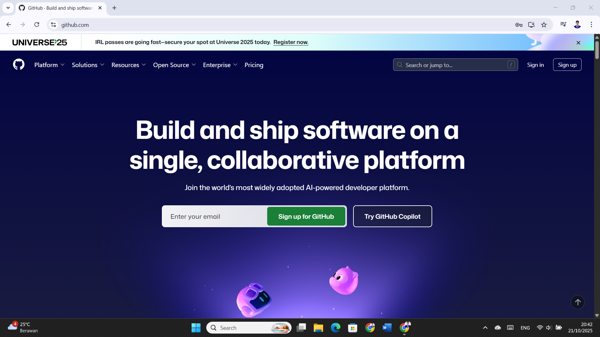  

### Login akun github  

Sebelum login pada github kita perlu mendaftar terlebih dahulu ada beberapa cara :  

•	Menggunakan akun google yang sudah ter login  pada komputer / laptop  

•	Bisa langsung mendaftar jika tidak ingin menggunakan email google  

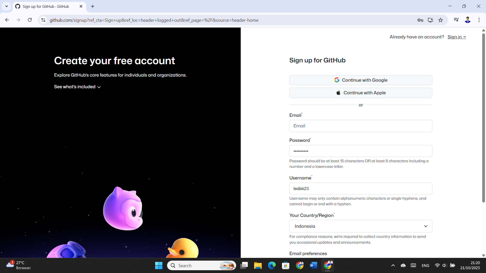  

•	Setelah mendaftar kita harus sign in seperti gambar berikut  

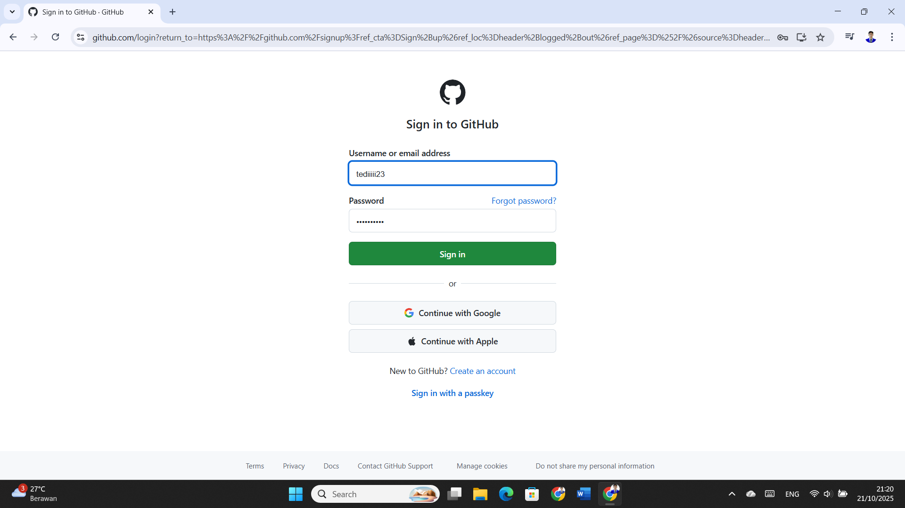  

•	Lalu tampilannya akan berubah ke halaman depan Github  

  

•	Buat repository baru dengan cara klik NEW atau icon + di pojok kanan atas lalu new repository  

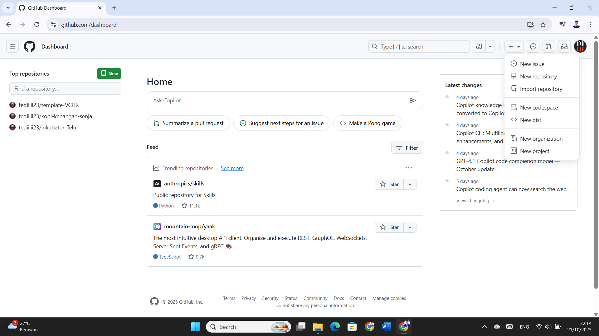  

•	Isi nama repository sesuai ketentuan  

•	Deskripsinya menjelaskan tentang apa  

•	Pilih create repository  

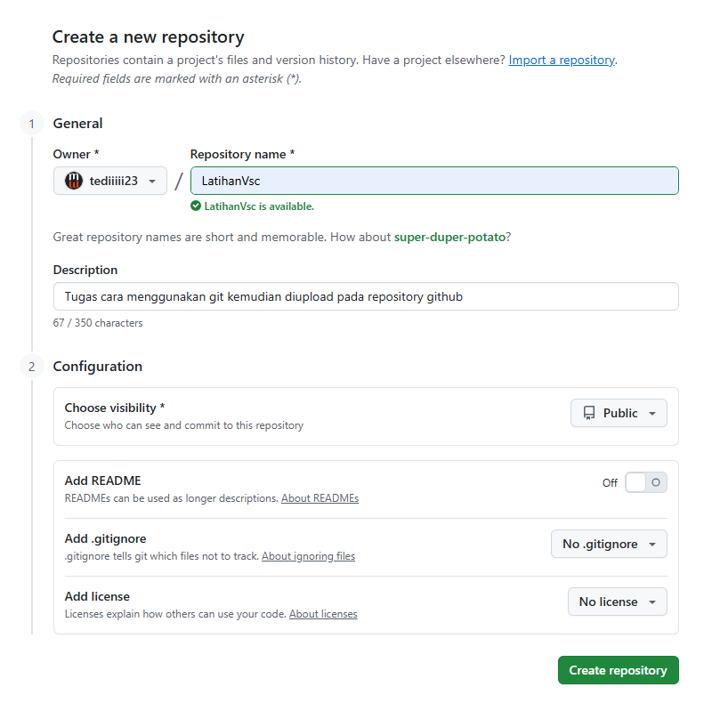  

•	Maka tampilannya akan seperti gambar berikut :  

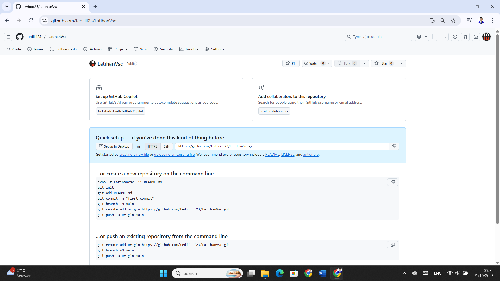  

•	Kita akan remote github ini menggunakan comment line gitbash  

•	Teks edittor nya menggunakan Vsc  

### Inisialisasi directory menggunakan gitbash  

•	Masukan perintah git init, untuk menginisialisasi directory jika berhasil maka tampilannya akan seperti gambar berikut  

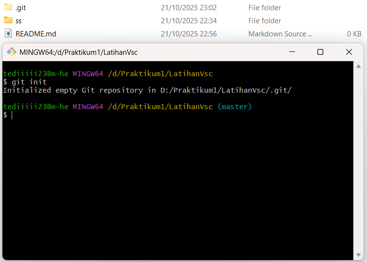  

•	Masukan perintah git add . untuk menambahkan semua file  

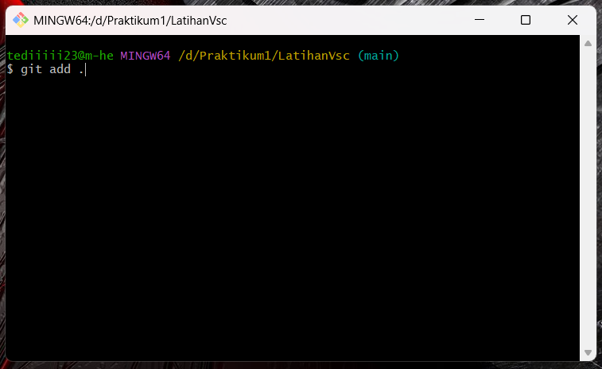  

•	Masukan perintah git remote add origin https://github.com/tediiiii23/LatihanVsc.git

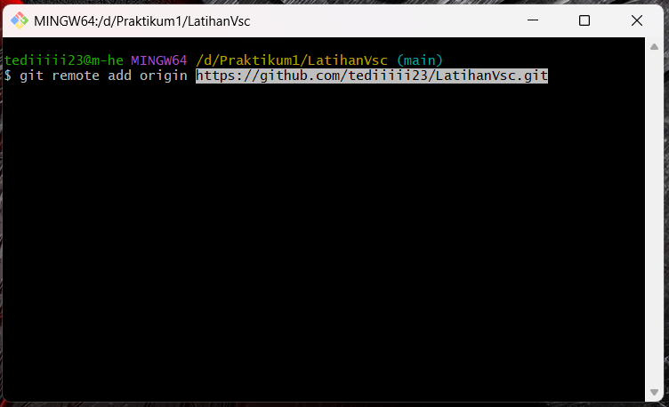  

•	Masukan perintah git commit -m "keterangan perubahan apa yang telah dilakukan"  

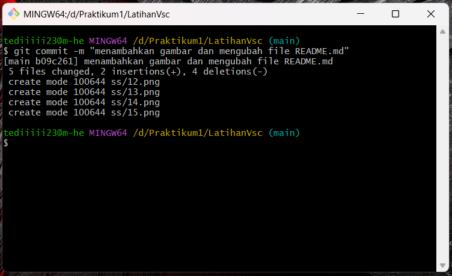  

•	Masukan perintah git push -u origin main untuk mengirim perubahan ke github  

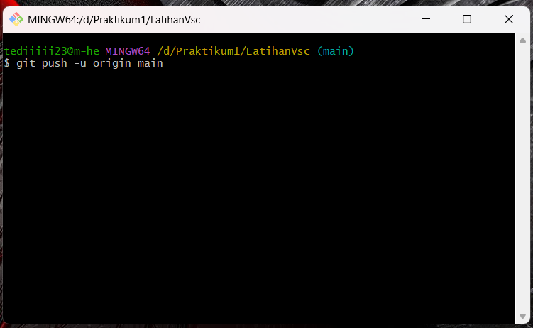  
