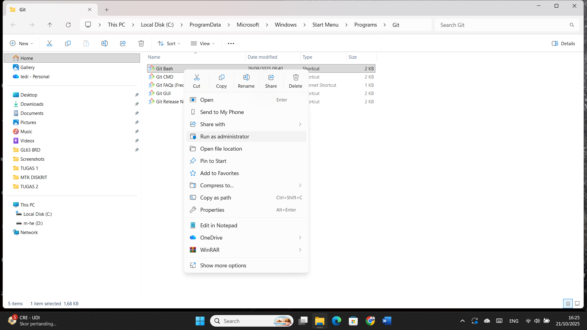
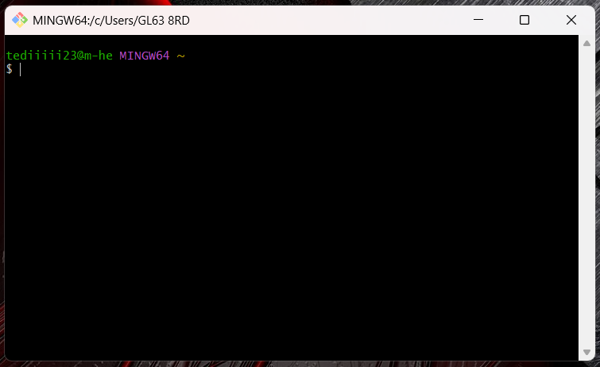
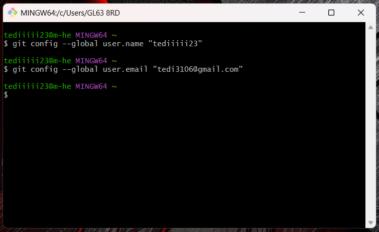

# NAMA	: TEDI MULYADI
# NIM	  : 312110114
# KELAS	: TI.21.C.1
# TUGAS	: BAHASA PEMROGRAMAN

### PERTANYAAN :

•   Buatlah satu repositories LATIHAN VCS
Buat file README.md, lalu isi file tersebut dengan penjelasan ( tutorial ) cara penggunaan git, dan langkah-langkahnya lengkapi juga dengan screenshot prosesnya

### JAWABAN :

### Install git 
•   Langkah yang pertama install software git pada link ini https://git-scm.com/install/. Kemudian sesuaikan dengan sistem operasi yang digunakan, misalnya windows 32/64bit setelah di download maka lakukan instalasi software seperti pada umumnya sampai selesai.
### Penggunaan dasar git 
setelah terinstall pada tahap sebelumnya, selanjutnya terdapat beberapa pilihan software, jalankan software yang namanya gitbash dengan cara :
#### •	bisa double klik pada icon gitbash
##### •	bisa klik kanan kemudian open 
###### •	bisa juga run as administrator

Contoh gambarnya :

### Setelah di jalankan maka akan seperti contoh gambar dibawah :

### Kemudian lakukan konfigurasi antara git dengan akun github yang telah dibuat, lalu tulis perintah untuk setup nama dan email:
•	git config –global user.name “tediiiii23”
•	git config –global uuser.email “tedi3106@gmail.com”

### Penggunaan git hampir sama seperti CMD pada windows. Beberapa perintah dasar git yang sering digunakan di antaranya :

